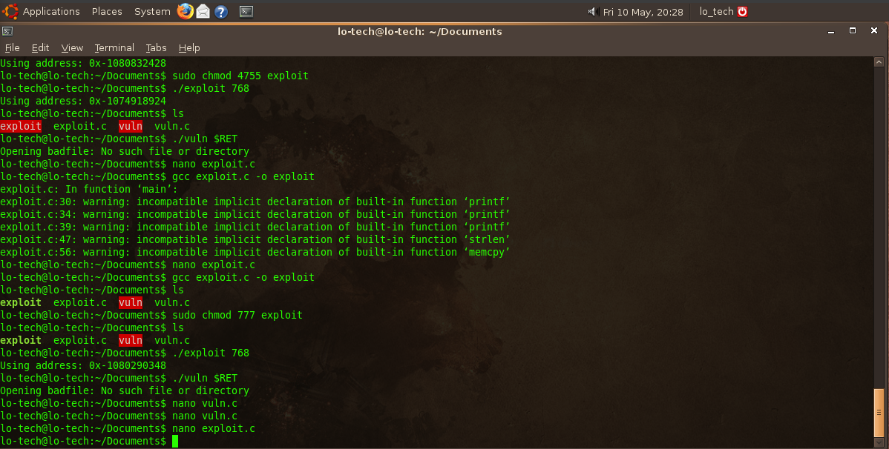
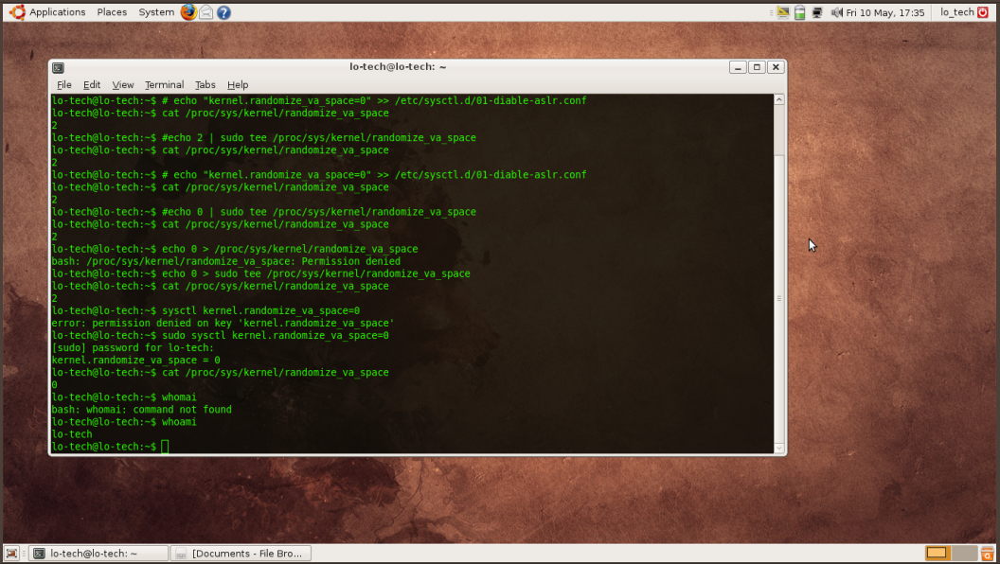
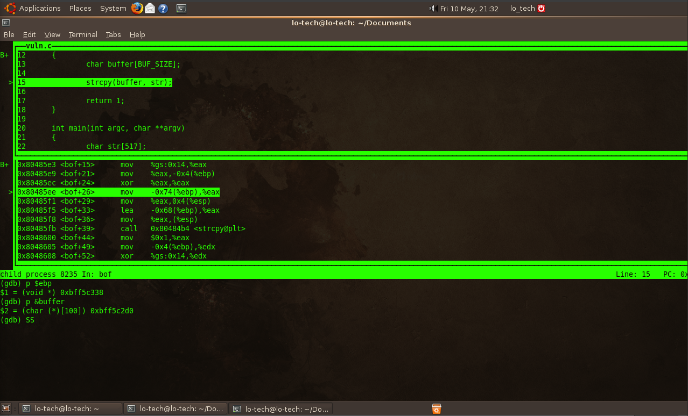
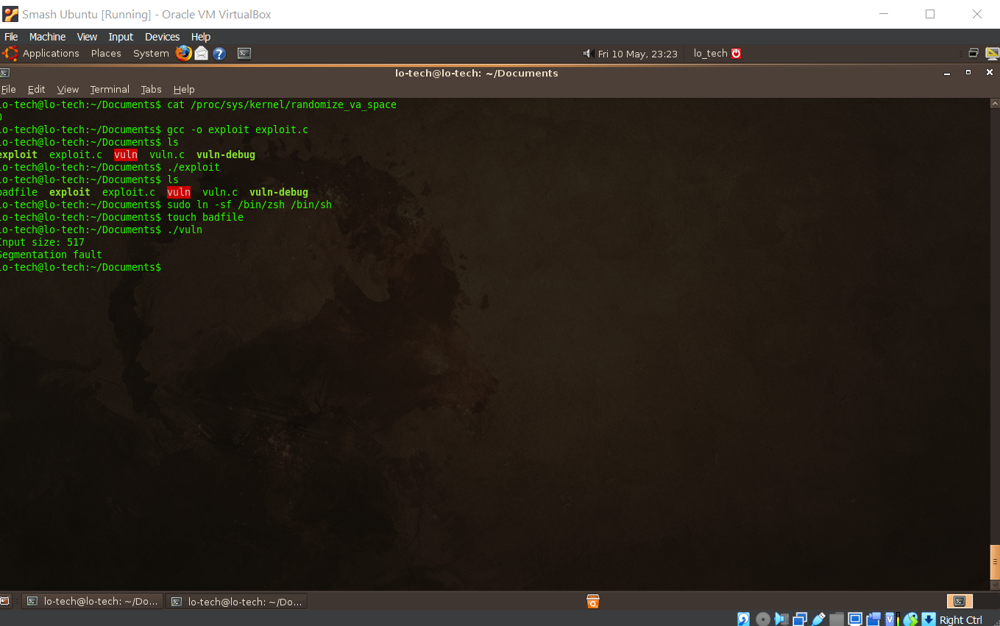
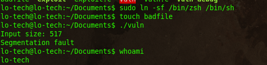

# Buffer Overflow Spring '24:

Linux Distribution:	Ubuntu 8.10
Architecture:		x86

This is a Buffer overflow simulation contained in a sandboxed environment.  
As this simulation was conducted in a virtual machine, no harm was done to another.

## 1st Attempt (unsuccessful)

Below is the first attempt to find the beginning of of the buffer in memory.  
Using the code from exploit iv in smash the stack didn't yield any success.



## 2nd Attempt (unsucessful)

In another attempt I tired the following:

* Disabling the ASLR
  


* Stepping into the vuln.c
* Locate the return address
* Find the adress of the buffer
  


## 3rd Attempt (successful)
Despite not gaining root access, I was able to overflow the buffer.



I successfully removed the aslr randomization, but wasn't able to gain root access.



The buffer overflow in apparent from the segmentation fault.

When calculating the offsets the return address minus the buffer adress was 0xbff5c338 - 0xbff5c2d0 = 104.  
Adding 104 + 4 = 108, should give access to the return address pointer and hijack it.

Adding 200-300 more to ebp will overflow the buffer into arbitrary code execution in the stack, found in exploit.c file.
That calculation was 0xbff5c338 + 200 in the hex calculator, yielding 0xbff5c400.  (this was adding 200)

On the latest attempt my steps were as follows in the same terminal:
- Turn off aslr
```
sudo ln -sf /bin/zsh bin/sh
gcc -o vuln -g -z execstack -fno-stack-protector vuln.c
```
- Change vuln permissions

```
sudo chown root vuln
sudo chmod 4755 vuln
```

- Compile exploit.c
- Make dummy bad file from exploit
- Touch badfile
- Run vuln
- Query username

I believe it was the offsets that were added into the address that needed more refinement to achieve root access.  This lab was appropriately the most difficult of the previous 3.  I've kept attempting to gain root access by ensuring the bad file was generated and not being empty.

In the final exploit file there is at least the letter "w" in the badfile. Since Ubuntu 8.10 was so old I could not transfer files in and out of the OS with any easy.


## Citations
smash the stack for fun and profit
https://www.youtube.com/watch?v=V9lMxx3iFWU
https://www.youtube.com/watch?v=hJ8IwyhqzD4
https://old-releases.ubuntu.com/releases/
https://www.rapidtables.com/convert/number/decimal-to-hex.html
https://www.calculator.net/hex-calculator.html?number1=bff5c338&c2op=%2B&number2=c8&calctype=op&x=Calculate
https://www.baeldung.com/linux/toggle-aslr-memory-randomization
https://aayushmalla56.medium.com/buffer-overflow-attack-dee62f8d6376
